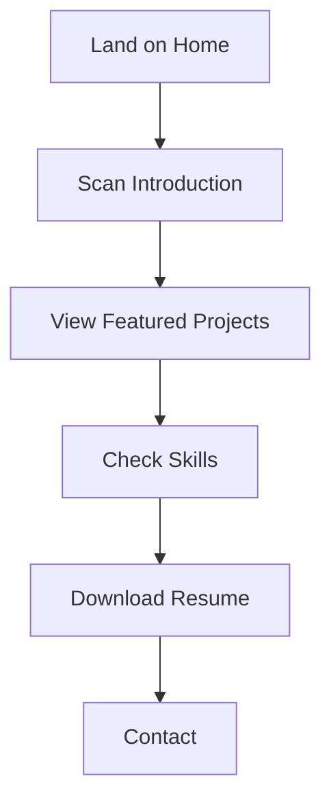
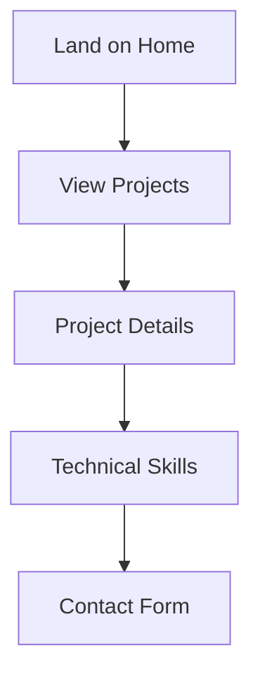

# Information Architecture Document

## 1. Site Structure

### Primary Navigation
```
Home
├── About
├── Projects
├── Skills
├── Experience
└── Contact
```

### URL Structure
```
/ (Home)
├── /about
├── /projects
│   └── /projects/[slug]
├── /skills
├── /experience
└── /contact
```

## 2. Page Layouts

### Home Page Structure
```
├── Hero Section
│   ├── Name & Title
│   ├── Brief Introduction
│   └── Call to Action
├── Featured Projects
│   ├── Project Cards (3)
│   └── View All Link
├── Skills Overview
│   ├── Technical Skills
│   ├── Design Skills
│   └── AI/LLM Expertise
├── Recent Experience
│   └── Timeline View
└── Contact Section
    └── Quick Contact Form
```

### Project Page Structure
```
├── Project Header
│   ├── Title
│   ├── Overview
│   └── Key Technologies
├── Problem Statement
├── Solution Approach
├── Implementation Details
│   ├── Technical Stack
│   ├── Design Decisions
│   └── AI Integration
├── Results & Impact
├── Live Demo (if applicable)
└── Next Project Navigation
```

### Skills Page Structure
```
├── Skills Overview
├── Technical Expertise
│   ├── Frontend Development
│   ├── UI/UX Design
│   └── AI/LLM Integration
├── Tools & Technologies
└── Learning Journey
```

## 3. Navigation Patterns

### Desktop Navigation
- Sticky header with main navigation
- Current page indicator
- Smooth scroll on home page
- Breadcrumbs on project pages

### Mobile Navigation
- Hamburger menu
- Collapsible sections
- Bottom navigation bar
- Back to top button

### Secondary Navigation
- Footer quick links
- Social media links
- Download resume button
- Language switcher (if needed)

## 4. Content Hierarchy

### Home Page Priority
1. Professional introduction
2. Featured projects
3. Key skills
4. Contact information
5. Recent experience

### Project Page Priority
1. Project overview
2. Problem and solution
3. Technical implementation
4. Results and impact
5. Related projects

### Skills Page Priority
1. Core competencies
2. Technical expertise
3. Design capabilities
4. AI/LLM knowledge
5. Learning journey

## 5. User Flows

### Primary User Flow (Recruiter)


### Secondary User Flow (Client)


## 6. Interactive Elements

### Global Interactions
- Navigation menu
- Contact buttons
- Social media links
- Resume download
- Theme switcher

### Project Interactions
- Project cards
- Live demos
- Code snippets
- Image galleries
- Video content

### Form Interactions
- Contact form
- Newsletter signup
- Project inquiry
- Feedback form

## 7. Content Types

### Text Content
- Professional bio
- Project descriptions
- Technical writing
- Blog posts
- Case studies

### Visual Content
- Project screenshots
- Process diagrams
- Skill icons
- Profile photos
- Brand assets

### Interactive Content
- Live demos
- Code playgrounds
- AI demonstrations
- Interactive prototypes

## 8. Page Templates

### Standard Page Template
```
├── Header
├── Main Content Area
│   ├── Page Title
│   ├── Content Sections
│   └── Related Content
└── Footer
```

### Project Template
```
├── Project Hero
├── Project Details
│   ├── Overview
│   ├── Process
│   └── Outcomes
├── Technical Details
└── Next/Previous Projects
```

### Landing Template
```
├── Hero Section
├── Featured Content
├── Key Sections
├── Call to Action
└── Footer
```

## 9. Content Modules

### Hero Module
- Background image/video
- Headline
- Subheadline
- Call to action button

### Project Card Module
- Project image
- Title
- Brief description
- Technologies used
- View more link

### Skills Module
- Skill category
- Proficiency level
- Related projects
- Learning resources

## 10. Responsive Behavior

### Desktop (1200px+)
- Full navigation
- Multi-column layouts
- Detailed project views
- Expanded content

### Tablet (768px - 1199px)
- Condensed navigation
- Reduced columns
- Adapted layouts
- Optimized images

### Mobile (320px - 767px)
- Hamburger menu
- Single column
- Stacked content
- Essential content only

## 11. Content Guidelines

### Writing Style
- Professional tone
- Technical accuracy
- Clear explanations
- Engaging narrative

### Content Length
- Project descriptions: 300-500 words
- About section: 200-300 words
- Skills descriptions: 100-150 words
- Blog posts: 800-1200 words

### Media Guidelines
- Image optimization
- Video compression
- Alt text requirements
- Lazy loading

## 12. SEO Structure

### Meta Information
- Title tags
- Meta descriptions
- Open Graph tags
- Twitter cards

### Content Structure
- Semantic HTML
- Heading hierarchy
- Internal linking
- Sitemap

## 13. Analytics Integration

### Track Points
- Page views
- Time on page
- Scroll depth
- Click patterns
- Form submissions

### Custom Events
- Project views
- Demo interactions
- Resume downloads
- Contact attempts

## 14. Error Handling

### 404 Page
- Friendly message
- Search option
- Popular links
- Return to home

### Form Errors
- Validation messages
- Error states
- Success feedback
- Recovery options

## 15. Performance Considerations

### Content Loading
- Progressive loading
- Image optimization
- Code splitting
- Cache strategy

### User Experience
- Loading states
- Transition effects
- Feedback mechanisms
- Error recovery